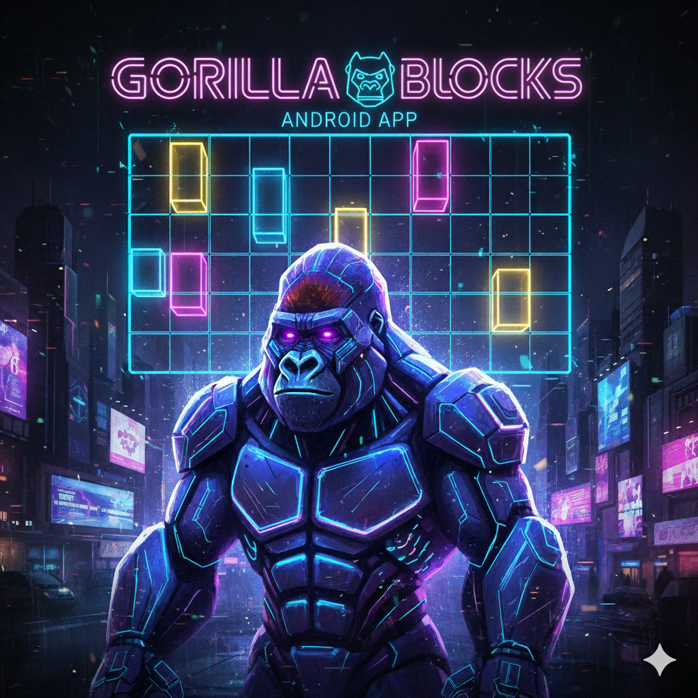
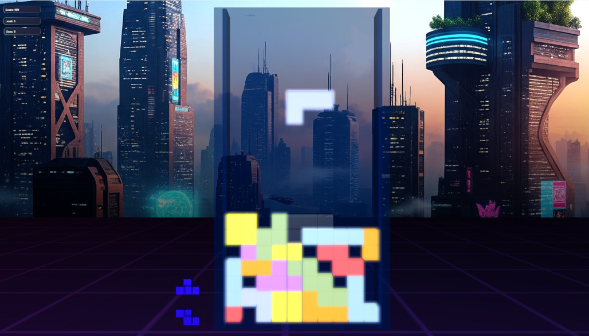

# 🦍 GorillaTetris - The Classic Block Puzzle in Stunning 3D

GorillaTetris is a mostly vibe coded **open-source 3D clone** of the timeless block-stacking puzzle game, built using the powerful **Gorilla3D** rendering engine. 
Experience Tetris like never before with modern graphical effects and optimized performance.

***

## ✨ Key Features

This project serves as an excellent demonstration of Gorilla3D's capabilities, utilizing several advanced rendering techniques:

* **Bloom Effect:** Adds a vibrant, soft glow to the game elements, enhancing the visual fidelity.
* **Different Materials:** Showcases various material properties for diverse block appearances.
* **Shader Coding:** Custom shaders are implemented to achieve unique visual effects.
* **Mesh Instancing:** Optimizes rendering performance by drawing multiple identical blocks with a single draw call.

***

## 🎮 Controls and Input

GorillaTetris supports both traditional keyboard input for desktop platforms and intuitive touch gestures for Android devices.

### Keyboard Controls (Desktop)

| Action | Input Key | Notes |
| :--- | :--- | :--- |
| **Move Piece Left** | $\leftarrow$ (Left Arrow) | |
| **Move Piece Right** | $\rightarrow$ (Right Arrow) | |
| **Rotate Counter Clockwise** | $\uparrow$ (Up Arrow) | |
| **Move Downwards** | $\downarrow$ (Down Arrow) | |
| **Hard Drop** | $\text{Spacebar}$ | Drops the piece instantly, granting more points. |

### Gesture Controls (Android/Touch)

| Action | Gesture | Notes |
| :--- | :--- | :--- |
| **Move Piece Left/Right** | $\text{Tap Left/Right}$ | Single tap on the respective side of the screen. |
| **Move Piece Left/Right** | $\text{Swipe Left/Right}$ | Short or long swipe across the screen. |
| **Rotate Clockwise/Counter Clockwise** | $\text{Swipe Up/Down}$ | Swiping up or down rotates the active piece. |
| **Hard Drop** | $\text{Two-Finger Swipe Down}$ | Drops the piece instantly, granting more points. |

***

## 🛠️ Technology & Requirements

This project requires the **Gorilla3D** framework to compile and run.

### Gorilla3D Dependency

* **Minimum Required Version:** `v1.1.12.3490` or later.
* **Installation:** The **Gorilla3D Developer Edition** can be easily installed directly through the Embarcadero GetIt Package Manager:
    [GetItNow - Gorilla3D Developer Edition](https://getitnow.embarcadero.com/gorilla3d-developer-edition/)

***

## 💻 Platform Support

GorillaTetris is designed for cross-platform play and supports the following targets:

* **Windows:** 32-bit and 64-bit
* **Android:** 32-bit and 64-bit
* **Linux:** x64 (64-bit)

***

## 🚀 Performance Recommendation

Given the use of 3D rendering, mesh instancing, and post-processing effects like Bloom, **medium hardware performance** is recommended for the best experience.

| Component | Recommendation |
| :--- | :--- |
| **CPU** | Dual-core processor @ 2.0 GHz or higher |
| **RAM** | 4 GB or more |
| **GPU** | Dedicated or modern integrated graphics with support for **OpenGL 4.3+** or **OpenGLES 3.1** on Android |
